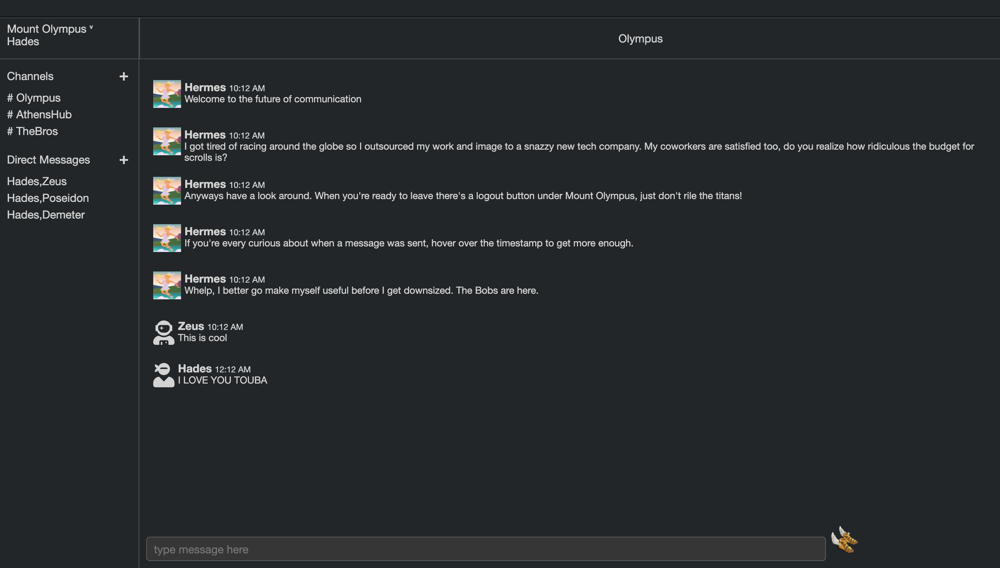
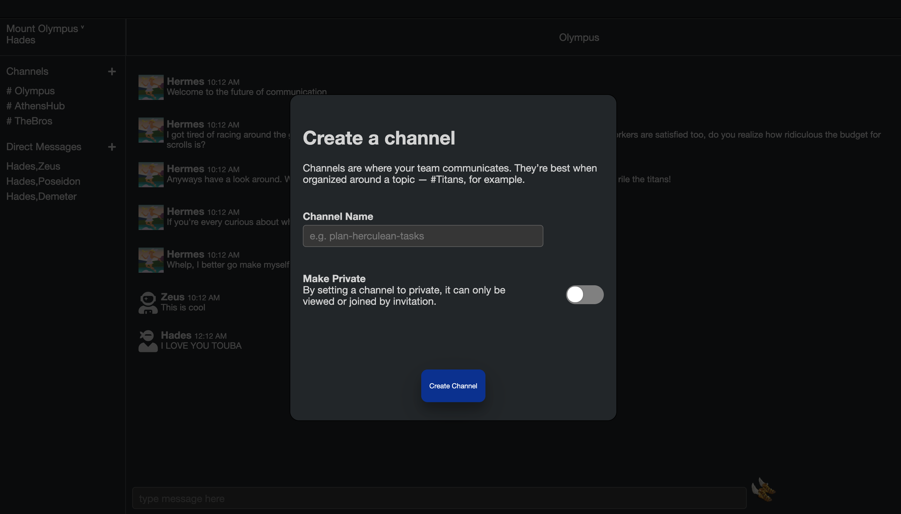

# Quicksliver 

[Live Demo](https://quicksilver1.herokuapp.com/#/)

## Description
Quicksilver is a single page messaging app, inspired by slack and greek mytholgoy. It allows user to create, send, and receive messages in realtime. 

## Technologies Used 
  * Backend: Ruby on Rails / PostgreSQL
  * Frontend: React / Redux / jquery 
  * Hosting: Heroku 
  * Websockets: ActionCable 
  
## Features 

**Channels** 
A user can have multiple channels that they either create or are shared with them. 


A user can create a private channel by toggling the switch 



## Live Chat Technical Overview 

 ActionCable was introduced around 2015 in Rails version 5. It allows for the creation of multiple Pub/Sub connections per websocket connection. A user can subscribe to and broadcast from multiple instances of a channel at the same time. When a user publishes information, it sent back to the channel "controller" using a custom defined method on the client side. From there the message is saved to the database and broadcast back to the appropriate channel instance. 
 
```javascript
  handleSubmit() {
    event.preventDefault();
    let message = { 
      //the channel id obtained from the route url and threaded from the parent component
      channelId: this.props.currentChannel, 
      body: this.state.body, 
      //the user id obtained from the session slice of state and threaded from the parent component
      userId: this.props.currentUser.id
    }
    //speak is a custom method that corresponds to a chatChannel method
    App.cable.subscriptions.subscriptions[0].speak({ message: message}); 
    this.setState({ body: "" });
  }
  ```
  
  ```ruby 
  class ChatChannel < ApplicationCable::Channel
  def subscribed
    # stream_from "some_channel"
  
    stream_for "room-#{params["room"]}:messages"
  end

  def speak(data) 
    message = Message.create(
      author_id: data['message']['userId'], 
      body: data['message']['body'], 
      channel_id: data['message']['channelId']
    )

    socket = { message: 
      {id: message.id, authorId: message.author_id, 
        body: message.body, 
        channelId: message.channel_id, 
        createdAt: message.created_at
      }
    }
    
    ChatChannel.broadcast_to("room-#{params["room"]}:messages", socket )
  end 
  
  def unsubscribed
    # Any cleanup needed when channel is unsubscribed
  end
end
```
